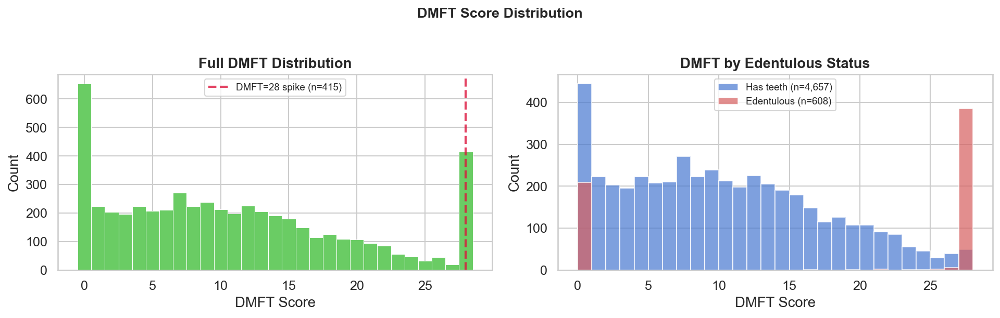
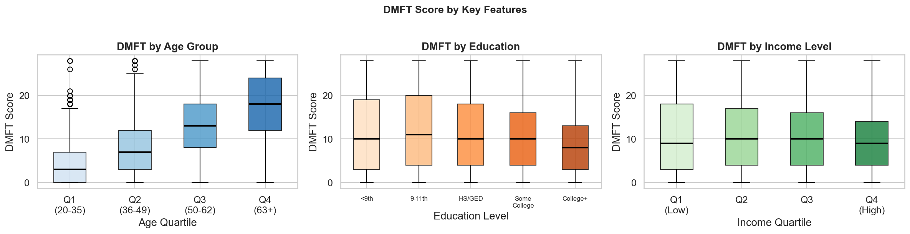
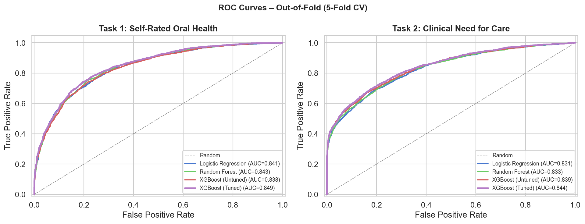
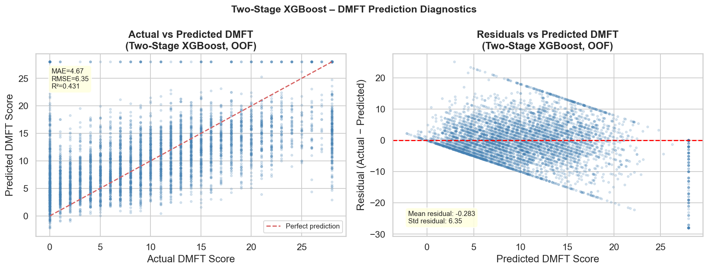

# Introduction and Literature Review

Oral diseases affect an estimated 3.7 billion people globally and untreated dental caries in permanent teeth ranks as the world's most common health condition [@who2025oral; @peres2019]. The personal consequences of chronic untreated disease (pain, sepsis, functional limitation, and reduced quality of life) fall disproportionately on people living in poverty and on socially marginalized groups, a pattern that holds across high, middle, and low-income countries alike [@peres2019]. In the United States this global pattern is especially salient. By age 50, the typical U.S. adult has experienced caries in about two-thirds of their permanent teeth, and nearly one in nine adults aged 20 and older has lost all of their natural teeth [@dye2017]. The direct costs of dental disease are considerable. The U.S. spends more than \$140 billion per year on dental services. Unlike many chronic conditions, oral disease is very preventable through a combination of behavioral, clinical, and structural interventions whose effectiveness is well established. The persistence of disease is less often a question of biomedical reasons and more often one of who has access to dental care and who does not.

The socioeconomic down-slope in oral health is among the most established findings in public-health research. Adults below the federal poverty line have roughly twice the rate of untreated decay of adults earning five or more times the poverty threshold. This gap has been stable for two decades [@braveman2011; @sabbah2007]. Similar disparities appear across education, insurance coverage, and race and ethnicity. Self-rated oral health, which measures patients' own perception of their dental status, shows comparable patterns and is an independent predictor of functional impact, quality of life, and health-care utilization [@locker2007; @slade1997].

The literature on modeling oral-health outcomes from survey data has generally used logistic regression with a small number of pre-selected covariates. These analyses emphasize interpretable coefficient estimates suitable for determining whether a specific exposure causes a particular health outcome but underutilized two capabilities of modern statistical learning. The first is the ability to discover non-linearity and interactions among many features, and the second, the ability to quantify out-of-sample predictive performance rather than in-sample model fit alone [@islr2021]. Both capabilities matter for policy-facing questions.

This project presents a comparative statistical learning analysis of three oral-health outcomes using a nationally representative sample of U.S. adults. It addresses three related questions. First, how accurately can an adult’s self-rated oral health be predicted using demographic characteristics, socioeconomic status, and reported access to and use of dental care? Second, how accurately can a clinician’s recommendation for dental treatment be predicted using those same variables along with a small set of self-reported oral-health symptoms? Third, how much variation in the continuous Decayed-Missing-Filled-Teeth (DMFT) score, a common overall measure of lifetime dental decay, can be explained using only upstream socioeconomic and access-related predictors, without direct clinical examination data?

To answer these questions, we use both shallow and deep learning approaches. For the three final prediction tasks, we compare a regularized linear model, a random forest, and gradient-boosted trees (XGBoost). Earlier in the project, we also developed a deep learning track based on feedforward neural networks that examined the relationship between dental health and income from a different direction, using the DMFT score to study income-related outcomes. Although that exploratory work is not directly aligned with the final tasks reported here, it helped shape the final study design and informed the comparison among the shallow methods. We also account for an important feature of the DMFT outcome: many adults have no remaining natural teeth, which creates a large cluster of values at the top of the scale. To address this, we use a two-stage regression framework that first predicts complete tooth loss and then estimates disease burden among those who still have natural teeth.

The primary goal of this is prediction rather than causal inference. We do not claim that factors such as income or education directly cause poor oral-health outcomes. Instead, we examine how well these well-established associations translate into out-of-sample predictive performance when practical challenges in survey data are properly addressed, including data leakage, class imbalance, missingness, and complex sampling design.

# Data Collection

## Source and scope

All data come from the 2017--2018 cycle of the National Health and Nutrition Examination Survey (NHANES), a continuous, nationally representative, cross-sectional survey administered by the National Center for Health Statistics [@nhanes2018]. Each participating adult completes an in-home interview, a Mobile Examination Center (MEC) clinical exam, and a self-administered questionnaire. NHANES releases the corresponding datasets as separate SAS transport files keyed on a common sequence number (`SEQN`). We downloaded four files directly from the public NHANES distribution:

- **DEMO_J** (demographics): age, sex, race and ethnicity, education, marital status, household composition, household income, and the income-to-poverty ratio (IPR).
- **OHXDEN_J** (oral-health dentition exam): tooth-by-tooth status and caries coding for all 32 tooth positions, plus summary flags for implants and root caries.
- **OHQ_J** (oral-health questionnaire): self-rated oral health, time since last dental visit, reasons for visits, reported unmet care, and 11 specific barriers-to-care indicators.
- **OHXREF_J** (oral-health recommendation of care): the examiner's overall recommendation code and diagnosis-specific referral flags.

The four files were merged on `SEQN` with a left join against `DEMO_J` as the anchor.

## Eligibility and filtering

We restricted the merged dataset to adults aged 20 and older who completed both the interview and the MEC exam (NHANES variable `RIDSTATR == 2`). Adults 20+ were chosen because their dentition is stable (they have all of their adult teeth) and because the access-to-care and self-rated health items on the questionnaire are asked only of adult respondents. Applying both filters gives a working datatset of 5,265 adult participants.

## Target variables

We derived three targets from the merged file.

*Target 1 --- Poor self-rated oral health* (`target_poor_selfrated`, binary) was coded 1 for participants whose answer to the NHANES self-rated oral-health item (`OHQ845`) was *Fair* (4) or *Poor* (5) and 0 otherwise. The positive rate in the full sample is 34.4%.

*Target 2 --- Clinician recommendation for care* (`target_needs_care`, binary) was coded 1 when the NHANES examiner issued any care recommendation other than "continue routine care" (`OHAREC < 4`). The observed positive rate is 42.5% among the 5,057 participants with a non-missing recommendation. The remaining 208 participants had a missing recommendation code and were excluded from Task 2 but kept elsewhere.

*Target 3 --- DMFT score* (`dmft_score`, continuous 0--28) was computed from the 28 caries codes (`OHXnnCTC`) in the dentition exam, summing decayed, filled-decayed, filled-sound, and missing-due-to-caries tooth counts in the classical Klein-Palmer method [@kleinpalmer1938]. There is a pronounced right-tail at 28 corresponding to edentulous adults (no natural teeth).

{#fig-dmft fig-align="center" width=90%}

For convenience, Table 1 summarizes the three prediction tasks referenced throughout the rest of the paper.

| Task    | Outcome (NHANES variable)                                  | Type                              | Sample size | Positive rate / mean |
|:--------|:-----------------------------------------------------------|:----------------------------------|:-----------:|:--------------------:|
| **Task 1** | Poor self-rated oral health (`target_poor_selfrated`, derived from `OHQ845`) | Binary classification (1 = *Fair* or *Poor*) | 5,265       | 34.4% positive       |
| **Task 2** | Clinician recommendation for any care (`target_needs_care`, derived from `OHAREC`) | Binary classification (1 = recommendation other than "continue routine care") | 5,057       | 42.5% positive       |
| **Task 3** | Decayed-Missing-Filled-Teeth score (`dmft_score`)         | Continuous regression (0--28)     | 5,265       | mean 10.74 (SD 8.42) |

: Quick reference for the three prediction tasks evaluated in this paper. Task 2 excludes 208 participants with a missing examiner recommendation; Tasks 1 and 3 use the full sample. {#tbl-tasks}

## Feature engineering and cleaning

Raw clinical tooth-level exam codes are not well suited for modeling, so we converted them into a smaller set of interpretable summary features. Specifically, we collapsed the 28 `OHXnnCTC` columns and 32 `OHXnnTC` columns into counts of decayed, filled-sound, filled-decayed, missing-due-to-caries, sound, and implanted teeth, along with the number of teeth present, the DMFT score, a treatment ratio, and a binary `is_edentulous` indicator for participants with no remaining natural teeth (`n = 608`, 11.5%). The treatment ratio was defined as the number of filled-sound teeth divided by the number of teeth that had ever experienced decay, and it served as a proxy for access to restorative care.

Several NHANES-specific coding conventions also had to be addressed before these variables could be used in a model. In NHANES, refusals and "don't know" responses are stored as numeric values such as `7` or `77` for *Refused* and `9` or `99` for *Don't know*. Because these codes are numeric, they can be mistakenly treated as meaningful values by statistical models. We therefore replaced them with `NaN` in eleven questionnaire variables.

NHANES also codes yes/no items as `1 = Yes` and `2 = No`, so we re-coded five such variables to the more standard `{0, 1}` format. This change was especially important for interpreting logistic regression coefficients. We also adjusted the income-to-poverty ratio by clipping a small number of near-zero floating-point artifacts and enforcing the survey's upper limit of `5.0`, resulting in a final range of $[0.05, 5.0]$. Finally, the eleven care-barrier items were converted into binary indicators. Because these variables are only populated for adults who reported any unmet dental need, missing values in those columns were interpreted as indicating that the specific barrier was not reported.

# Methods

## Feature sets

The three modeling tasks used slightly different predictor sets. Task 1 included 32 features, Task 2 included 36, and Task 3 included 28. Across tasks, these predictors fell into five broad categories: socioeconomic background, demographics, access to and use of dental care, oral-health-related behaviors, and, for Tasks 2 and 3, self-reported oral-health symptoms.

The socioeconomic variables included measures such as income relative to the poverty line and educational attainment. The demographic variables included age, sex, race and ethnicity, marital status, household size, and country of birth. The dental care access variables captured factors such as time since the last dental visit, whether dental care was needed but not obtained, and eleven reported barriers to receiving care.

The behavioral variables included flossing frequency, prior treatment for gum disease, and prior oral cancer examination. For Tasks 2 and 3, we also included a small set of self-reported symptom variables to reflect how participants described their own oral-health problems.

## Models and cross-validation

For each of the three downstream tasks, we compared three shallow model classes, moving from a simple linear baseline to more flexible non-linear ensemble methods. We also include, as a fourth modeling component, an earlier deep learning analysis that helped shape the final framing of the project.

1. **Logistic regression (Tasks 1 and 2) / Ridge regression (Task 3).**  
   These models served as the baseline. For the classification tasks, we used logistic regression with standardized inputs and balanced class weights. For the regression task, we used ridge regression with $\alpha = 1.0$. These models are useful because they are easy to interpret and provide a clear linear benchmark.

2. **Random forest.**  
   This method combines many decision trees into a single model. We used 300 to 500 trees, square-root feature sampling, and balanced class weights for the classification tasks. Random forests are useful because they can capture non-linear relationships and are less sensitive to correlated predictors [@breiman2001].

3. **Gradient-boosted trees (XGBoost).**  
   We used XGBoost, which builds trees sequentially so that each new tree focuses on correcting errors made by earlier ones. We used 300 to 500 estimators, a learning rate of 0.05, and a maximum depth of 4. For the classification tasks, we adjusted class weights to account for class imbalance. For Tasks 1 and 2, we also carried out a randomized hyperparameter search with stratified 5-fold cross-validation and ROC-AUC as the tuning metric.

4. **Feedforward neural networks (deep learning).**  
   Earlier in the project, we also explored a separate deep learning track that addressed a different question. Instead of predicting oral-health outcomes from upstream social and behavioral factors, this analysis examined whether income could be predicted from dental information alone. We used DMFT as the input and trained three versions of the model: a 14-class model for NHANES household income brackets, a binary model for whether a person was above or below the federal poverty line, and a regression model for the continuous income-to-poverty ratio.

   These networks used a three-layer fully connected architecture with 128, 64, and 32 hidden units. Each hidden layer used ReLU activation, and dropout of 0.2 was applied between layers. We trained the models with Adam at a learning rate of 0.001, a batch size of 32, and up to 50 epochs, with early stopping based on a patience of 10 epochs. Each version used the standard loss function for its task: categorical cross-entropy for the multi-class model, binary cross-entropy for the binary model, and mean squared error for the continuous model.

Although this deep learning track was exploratory, it played an important role in shaping the broader project. It helped us become familiar with the NHANES dental and income variables, showed that a single clinical summary such as DMFT contains some information about income on its own, and motivated the broader prediction framework used in the main analysis. It also provides useful context for a larger point that appears throughout the study, namely that in tabular survey data of this size, what can be learned depends not only on the model family but also on the direction of the prediction task [@islr2021].

All models were evaluated with 5-fold cross-validation. For the classification tasks, we used stratified folds so that each fold preserved the overall class balance. For the regression task, we used standard random folds. Any preprocessing steps, including imputation and scaling, were fit only on the training portion of each fold and then applied to the validation portion.

For the classification tasks, we report balanced accuracy, ROC-AUC, and weighted F1. For the regression task, we report MAE, RMSE, and $R^2$. We treat ROC-AUC as the main classification metric because it does not depend on a single threshold and remains informative under mild class imbalance. For the DMFT regression task, we treat MAE as the main metric because it is easy to interpret on the original scale of the outcome, measured in number of teeth, and because it is less affected than RMSE or $R^2$ by the large cluster of cases at `DMFT = 28`.

## Two-stage model for DMFT

The DMFT outcome was not evenly spread across values. One clear reason was a large cluster at 28, which often reflected complete tooth loss. In our sample, 385 of the 608 adults with no remaining natural teeth, or 63%, had a DMFT score of exactly 28. This matters because having no teeth is a separate state of dental health. If we fit one regression model to everyone, the model can become overly focused on predicting total tooth loss instead of differences in DMFT among adults who still have natural teeth. That can worsen prediction error and make the results harder to interpret. To handle this, we used a two-stage approach inside each cross-validation fold. In Stage 1, an XGBoost classifier predicted whether a participant was edentulous. In Stage 2, an XGBoost regressor was trained only on non-edentulous participants to predict their DMFT score. Anyone predicted to be edentulous in Stage 1 was assigned a DMFT value of 28. Everyone else received the continuous DMFT prediction from Stage 2. Both stages used the same hyperparameter settings as the single-stage XGBoost model.

# Results

## Sample description

The working sample included 5,265 adults. The mean age was 51.4 years (`SD = 17.7`, range 20 to 80), and 51.7% of participants were female. The self-identified race and ethnicity distribution was 34.3% Non-Hispanic White, 23.6% Non-Hispanic Black, 19.4% in the combined *Non-Hispanic Asian / Other* category (`NHANES code 5`), 13.3% Mexican American, and 9.4% Other Hispanic. This distribution reflects NHANES's intentional oversampling of minority populations.

The mean income-to-poverty ratio was 2.50 (`SD = 1.50`), and 16.5% of adults were below the federal poverty line (`IPR \leq 1`). The engineered dental measures also indicated substantial disease burden. Participants had an average of 21.9 teeth present out of a possible 32 (`SD = 10.0`), the mean DMFT score was 10.7, and 11.5% of adults were edentulous.

{#fig-dmft-ses fig-align="center" width=95%}

The two binary targets are moderately imbalanced (34.4% and 42.5% positive, respectively), well within the range where ROC-AUC will still be reliable.

## Task 1 --- Poor self-rated oral health

Table 1 reports 5-fold cross-validated performance for Task 1.

| Model                 | Balanced Accuracy | ROC-AUC | Weighted F1 |
|:----------------------|:-----------------:|:-------:|:-----------:|
| Logistic Regression   | 0.755             | 0.841   | 0.768       |
| Random Forest         | 0.733             | 0.843   | 0.775       |
| XGBoost (default)     | 0.759             | 0.838   | 0.774       |
| **XGBoost (tuned)**   | **0.770**         | **0.849** | **0.785**   |

: 5-fold cross-validated performance for Task 1 (predicting *Fair* or *Poor* self-rated oral health). Tuned XGBoost used `n_estimators=1000`, `max_depth=3`, `learning_rate=0.01`, `subsample=0.8`, `colsample_bytree=0.8`, `min_child_weight=5`, `gamma=0.1`. {#tbl-task1}

All three model families converge on ROC-AUC values between 0.83 and 0.85, showing astrong and consistent signal from the input features. The tuned XGBoost has the best overall performance (ROC-AUC 0.849), but only marginally better than the regularized logistic regression with a difference of only 0.01 AUC. This is itself an important finding. A substantial share of the predictive signal in Task 1 is linear in the SES and access block of features. Feature-importance analysis ranks income-to-poverty ratio, age, time since last dental visit, reported cost-barrier, and DMFT as the top five predictors. These five alone have about three-fourths of the total importance weight.

## Task 2 --- Clinician recommendation for care

Task 2 uses the 5,057 adults with an observed examiner recommendation and a 36-feature input including self-reported symptoms.

| Model                 | Balanced Accuracy | ROC-AUC | Weighted F1 |
|:----------------------|:-----------------:|:-------:|:-----------:|
| Logistic Regression   | 0.747             | 0.831   | 0.755       |
| Random Forest         | 0.743             | 0.834   | 0.757       |
| XGBoost (default)     | 0.747             | 0.840   | 0.755       |
| **XGBoost (tuned)**   | **0.766**         | **0.844** | **0.776**   |

: 5-fold cross-validated performance for Task 2 (predicting clinician-identified need for dental care). Tuned XGBoost used `n_estimators=500`, `max_depth=5`, `learning_rate=0.01`, `subsample=0.7`, `colsample_bytree=0.8`, `min_child_weight=1`, `gamma=0.1`. {#tbl-task2}

{#fig-roc fig-align="center" width=90%}

Task 2 performed slightly worse than Task 1, with AUC values of 0.83 to 0.84 compared with 0.83 to 0.85 for Task 1. This makes sense because the Task 2 outcome reflects a clinician's judgment rather than a person's own self-rating. As a result, it is somewhat less closely tied to self-reported features. Even so, the self-reported symptom variables still added useful information. In both the random forest and XGBoost models, `thinks_has_gum_disease`, `told_bone_loss_around_teeth`, and the frequency of mouth aching were all among the top fifteen features. These ranked above every care-barrier variable except cost.

## Task 3 --- DMFT regression

Task 3 uses 28 upstream features with all raw clinical exam variables excluded. The naive baseline (predicting the sample mean of 10.74 for every participant) yields MAE = 6.98.

| Model                          | MAE     | RMSE    | $R^2$   |
|:-------------------------------|:-------:|:-------:|:-------:|
| Ridge Regression               | 5.06    | 6.39    | 0.423   |
| Random Forest                  | 4.83    | 6.24    | 0.451   |
| XGBoost (single-stage)         | 4.74    | 6.14    | **0.469** |
| **XGBoost (two-stage)**        | **4.67** | 6.35    | 0.431   |

: 5-fold cross-validated performance for Task 3 (predicting continuous DMFT score from upstream features only). The two-stage model classifies edentulous status in Stage 1 and assigns DMFT = 28 to those participants, regressing DMFT among the remainder in Stage 2. {#tbl-task3}

{#fig-task3-diag fig-align="center" width=90%}

All three statistical-learning models greatly outperform the naive baseline, reducing MAE by roughly 33%. The two-stage model achieves the lowest MAE (4.67) and respects the discontinuity at complete tooth loss. The single-stage XGBoost achieves a slightly higher $R^2$ (0.468 vs 0.431) because $R^2$ rewards models that capture the full DMFT distribution, including the edentulous cluster. MAE, which penalizes the edentulous cluster more evenly, favors the two-stage model. Feature-importance analysis of the two stages shows their respective roles. Stage 1 (predicting edentulousness) is dominated by age, education, and income, reflecting the well-known lifetime loss in teeth (one cannot gain teeth over time). Stage 2 (predicting DMFT among non-edentulous adults) is dominated by age, income-to-poverty ratio, time since last dental visit, and education, in that order.

## Cross-task consistency

One of the clearest findings across the three tasks is how similar the most important predictors were. Income-to-poverty ratio, age, time since the last dental visit, education, and reported cost-related barriers all appeared among the top ten features for every outcome. This pattern suggests that the same broad set of social and access-related factors is shaping all three oral-health measures, which is consistent with prior public-health research on the social determinants of oral health [@braveman2011; @northridge2020].

{#fig-importance fig-align="center" width=100%}

This also suggests that one simpler model might capture much of the signal now handled by three separate task-specific models. That approach would likely give up some accuracy for each individual task, but it could still be useful in primary care settings where a simpler screening tool is more practical.

# Discussion

Several findings from the results are worth discussing.

**Most of the predictive signal appears to be largely linear, though some non-linearity remains.** On both binary tasks, regularized logistic regression performed within about 0.01 AUC of the tuned XGBoost model. Given the large number of socioeconomic, access, and care-barrier variables, and given that no single predictor appeared to dominate the descriptive patterns, we expected boosting to gain more from combining many weaker signals in more complex ways. Instead, the results suggest that the strongest predictors, especially income, age, education, and time since the last dental visit, operate mostly in an additive way on the log-odds scale. In practical terms, this means that a linear model with balanced class weights captures most of the available signal. The slightly stronger performance of XGBoost indicates that some additional non-linear structure is still present, likely through a limited number of interactions that the logistic model cannot represent unless they are specified directly.

**The edentulous group is important for both prediction and interpretation.** About one in nine adults in the sample had no remaining natural teeth. On average, these adults were older, had lower income, and had less education than adults who still had teeth. At the same time, they showed a lower rate of `target_needs_care`. This pattern may appear counterintuitive, but it does not imply better oral health. A more likely explanation is that once a person has no natural teeth remaining, there are fewer tooth-level treatment recommendations an examiner can make. This creates an important modeling issue. If a model is trained on the full sample without accounting for edentulousness, it may understate care needs for one of the most vulnerable groups in the dataset.

**Limitations.** This project has three main limitations. First, the 2017 to 2018 NHANES data are cross-sectional, so all variables were measured at the same time. Because of this, we cannot say that one factor caused another. The results should be viewed as predictive, not causal. Second, we evaluated the models with standard cross-validation and did not fully account for survey weights or the full NHANES sampling design. Third, the deep learning part of the project was developed earlier, when the study focused on a different question. Because of that, it was not set up as a direct comparison with the three final tasks. Based on the shallow-model results and prior research on tabular data, a more heavily tuned neural network would probably not perform much better than gradient boosting at this sample size and feature count [@islr2021]. Still, extending the deep learning analysis to match the final tasks would be a reasonable next step.

# Conclusion

Three findings stand out from this analysis. First, all three oral-health outcomes are predictable to a clinically meaningful degree from a relatively small set of commonly collected variables. Tuned XGBoost reached a cross-validated ROC-AUC of 0.849 for self-rated poor oral health and 0.844 for examiner-identified need for care, and the two-stage regression reduced mean absolute error on DMFT from 6.98 teeth under a naive baseline to 4.67 teeth, a 33% improvement, using only upstream predictors and no direct clinical exam data. Second, the same core set of predictors, including income-to-poverty ratio, age, time since the last dental visit, education, and cost-related barriers, appeared in the top ranks for every task. This cross-task consistency strengthens the interpretation that a common social and access-related structure underlies all three outcomes rather than each outcome being driven by its own idiosyncratic factors. Third, modeling complete tooth loss as a distinct state materially improved both predictive accuracy on the original scale and the interpretability of the results, particularly for the subgroup of adults most affected by cumulative disease burden.

Taken together, these results support two broader points. From a public-health standpoint, they reinforce the evidence that oral-health disparities in U.S. adults are tightly coupled to a small number of well-established social determinants, and that a short list of routinely collected survey items is sufficient to identify individuals at risk of poor oral health or unmet treatment need. This is relevant to screening and surveillance in primary care and community settings, where a lightweight, non-clinical instrument could help flag adults who would benefit from targeted outreach or help finding care, even in the absence of a dental exam. From a statistical learning standpoint, the near-equivalence between regularized logistic regression and tuned gradient boosting on the two classification tasks is a good reminder that on moderately sized tabular survey data with strong, largely additive predictors, flexible non-linear methods offer incremental gains.

# References

::: {#refs}
:::
